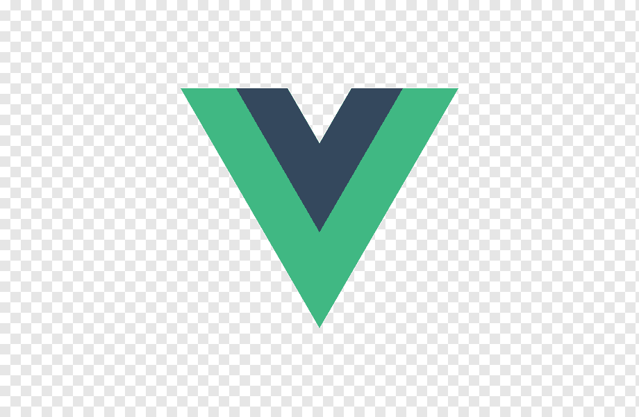

Here are the differnt versions of the Vue logo.

## No Text

### PNG

### Transparent PNG

### JPG/JPEG

### SVG

<object data="../../assets/images/vue/vue.svg" type="image/svg+xml" style="width:50%; height:50%"></object>

## With Text

### PNG

### JPG/JPEG

### SVG

<object data="../../assets/images/vue/vue-spelled-out.svg" type="image/svg+xml"></object>